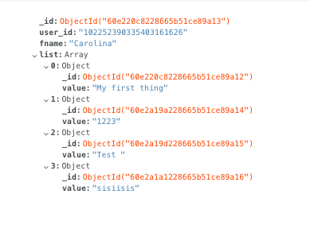

# project-23

The app will let user log in using Google Authentication, add items and delete individual items and all at once.

Video of the app in the following [link](https://drive.google.com/file/d/1ca3xTW_A-Q5QBlI-CuV5N_JJ_xoYq_Gr/view?usp=sharing)

## Table of contents

1.[UX](#ux)

* [User Stories](#user-stories)
* [Styling](#styling)
  * [Colours](#colours)
  * [Fonts](#fonts)
  * [Favicon](#favicon)

2.[Features](#features)

* [Database design](#database-design)
* [Site features](#site-features)

3.[Technologies used](#technologies-used)

* [Languages](#languages)
* [Libraries](#libraries)
* [Programs and tools](#programs-and-tools)

4.[Testing](#testing)

5.[Deployment](#deployment)

* [Cloning](#cloning)
* [Deploying app to Heroku](#Deploying-app-to-Heroku)

6.[Credits](#credits)

<h1> User Experience </h1>

## **User stories**

* As a user I want to log in using my Google Account.
* As a user I want to be able to add items to my list.
* As a user I want to delete individual items.
* As a user I want to delete all items at once.

## **Styling**

### Colours

Using [Colorhunt.co](https://colorhunt.co) I chose a simple palette with simple colours for an easy site navigation:

*  `#413B88` - Navbar and add items button.
*  `#ecda92` - Hoover buttons.
* Tomato for Delete items and delete all.

### Fonts

* [Bebas Neue](https://fonts.google.com/specimen/Bebas+Neue?query=bebas+) - Site name
* [Quicksand](https://fonts.google.com/specimen/Quicksand?query=quicksa) - All content on the page.

### Favicon

One of the emojis available on [Favicon.io](https://favicon.io/emoji-favicons/)

<h1> 2. Features </h1>

## Operations

The user can create, read and delete content in the page.

### Create

* Users can sign up and create an account.
* Users can add elements to the list.

### Read

* Users can access to their list once they are logged in.

### Delete

* Users can delete single items.
* Users can delete all items at once.

## Database design

### **users collection**

| Field Description | Collection Key | Data type |
| --- | --- | --- |
| Unique ID | _id | ObjectId |
| User ID | user_id | String |
| First name | fname | String |

Objects inside the list array:

| Field Description | Collection Key | Data type |
| --- | --- | --- |
| Unique ID | _id | ObjectId
| List | value | String |
|||

Here a screenshot of the collection in the database:
 

h1> 3. Technologies Used </h1>

## Languages

* [Python3](https://www.python.org/) - Used to create the main application functionality
* [HTML5](https://www.w3schools.com/html/) -  to build the structure of this site.
* [CSS3](https://www.w3schools.com/css/) - to style the page, and fix media queries and the max width.

## Libraries

* [Flask](https://www.fullstackpython.com/flask.html) - Python web framework
* [PyMongo](https://pymongo.readthedocs.io/en/stable/) - PyMongo is a Python tool for working with MongoDB.
* [Flask-Pymongo](https://flask-pymongo.readthedocs.io/en/latest/) - Flask-PyMongo bridges the gap between Flask and PyMongo.
* [Google OAuth 2.0](https://developers.google.com/identity/protocols/oauth2) - To access Google APIs and retrieve the users information when they log in.
* [Jinja](https://jinja.palletsprojects.com/en/2.11.x/) - Template language for Python.

## Programs and Tools

* [VSCode](https://code.visualstudio.com/) - used as IDE for the project.
* [Git](https://git-scm.com/) - used for version control.
* [Github](https://github.com/) - used to host repository and to generate the live website.
* [Google Fonts](https://fonts.google.com) - used for fonts on the site.
* [Chrome Developer Tools](https://developers.google.com/web/tools/chrome-devtools) - used to test and optimize the site.
* [randomkeygen.com](https://randomkeygen.com/) - Random secure password & keygen generator used to create the Flask SECRET_KEY.

<h1> 4. Testing </h1>

The app has been manually tested only on the server.
Responsiveness tested as well using Google Chrome Developer tools.

<h1> 5. Deployment </h1>

As I'm waiting for my Google payment account to be confirmed I haven't deployed it yet.

<h1> 7. Acknowledgements </h1>

The main functionality of my site has been found in:

* To set up Google Authorization I followed this [tutorial](https://www.youtube.com/watch?v=FKgJEfrhU1E)
* [Personal project](https://github.com/CarolinaCobo/la-biblioteca-ms3)

Also: 
* [MDN Documentation](https://developer.mozilla.org/en-US/)
* [W3Schools](https://www.w3schools.com/)
* [StackOverflow](https://stackoverflow.com/)
* [Codú Community](https://www.youtube.com/channel/UCvI5azOD4eDumpshr00EfIw)
* [FreeCodeCamp](https://www.freecodecamp.org/)
